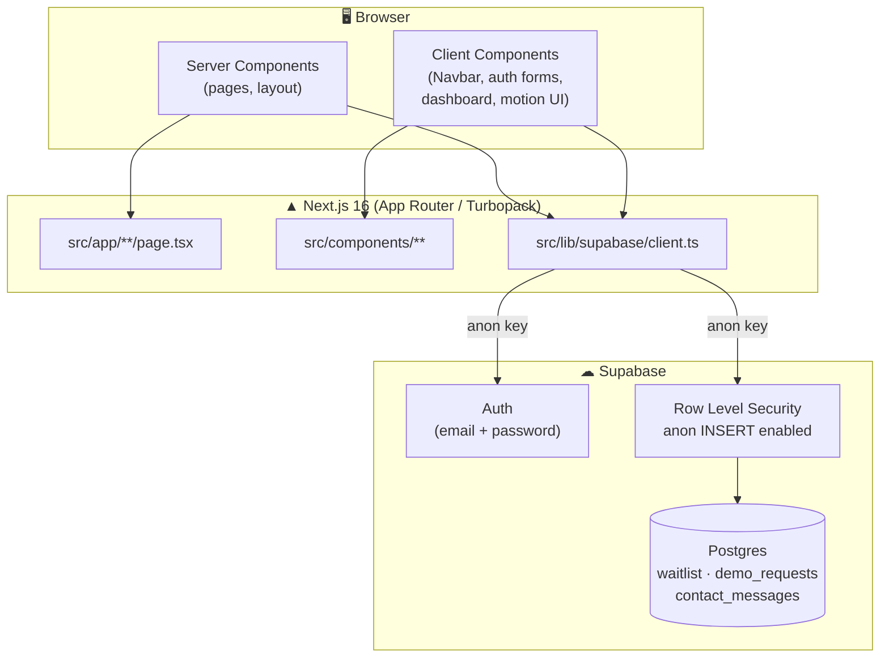
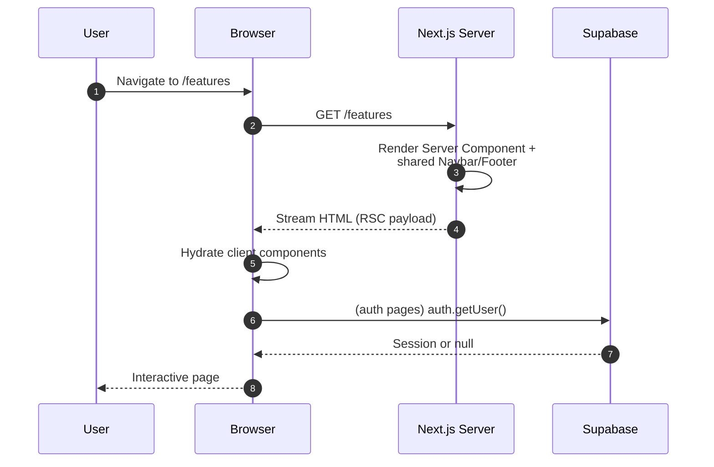
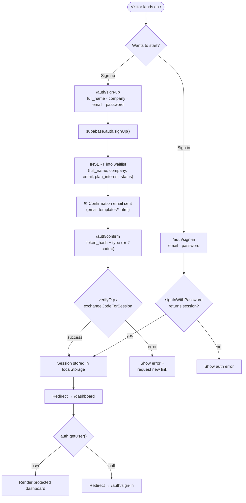
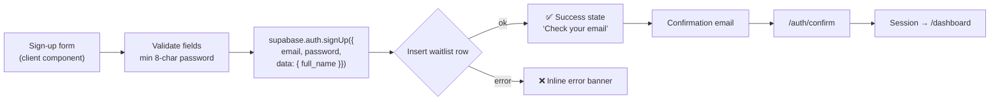
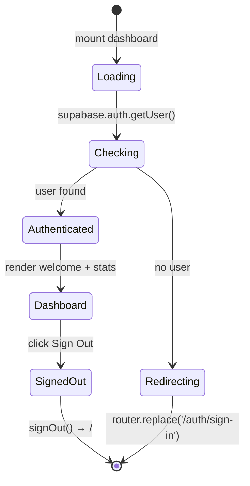
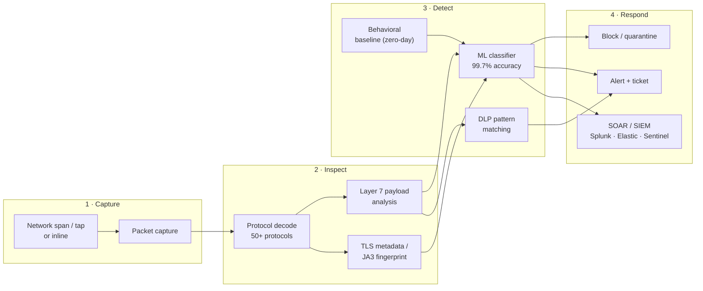

# NetShield DPI — Deep Packet Inspection Security Platform

Enterprise deep packet inspection (DPI) with machine learning-powered threat detection, real-time analytics, and automated response. Built by **Smoke Monkey** with Next.js 16 + Supabase.

> **Live site:** [netshield-dpi.vercel.app](https://netshield-dpi.vercel.app) · **Repo:** [RajdeepDevelopment/netshield-dpi](https://github.com/RajdeepDevelopment/netshield-dpi)

---

## 📚 Table of Contents

- [Features](#-features)
- [Architecture](#-architecture)
- [Flow Diagrams](#-flow-diagrams)
  - [Request Lifecycle](#1-request-lifecycle)
  - [Authentication & Onboarding](#2-authentication--onboarding)
  - [Sign-Up / Waitlist Flow](#3-sign-up--waitlist-flow)
  - [Protected Dashboard Flow](#4-protected-dashboard-flow)
  - [DPI Inspection Pipeline](#5-dpi-inspection-pipeline-product-concept)
- [Quick Start](#-quick-start)
- [Environment Variables](#-environment-variables)
- [Project Structure](#-project-structure)
- [Auth & Data](#-auth--data)
- [Stack](#-stack)
- [Deploy](#-deploy)
- [Pages](#-pages)
- [Scripts](#-scripts)

---

## ✨ Features

- **Deep Packet Inspection (DPI)** — Layer 7 payload analysis for threat, DLP, and policy detection
- **Real-Time Threat Detection** — ML-powered classification of malicious traffic (99.7% accuracy)
- **Encrypted Traffic Analysis** — JA3 fingerprinting and TLS metadata inspection without decryption
- **Protocol Analysis** — 50+ protocols decoded: HTTP/S, DNS, SMTP, FTP, SSH, SCADA/ICS
- **Zero-Day Protection** — Behavioral baselining catches unknown threats
- **Data Loss Prevention** — Regex/pattern DLP on packet payloads
- **Automated Response** — Block, quarantine, ticket, or SOAR triggers
- **SIEM Integrations** — Splunk, Elastic, Sentinel, and 40+ platforms

---

## 🏗 Architecture

NetShield is a **Next.js 16 App Router** marketing site with a **Supabase** backend
(Postgres + Auth + Row Level Security). Pages are React Server Components by
default; interactive pieces (`Navbar`, auth forms, dashboard) are client
components. There is no separate API server — the browser talks to Supabase
directly using the public anon key.



---

## 🔀 Flow Diagrams

All diagrams below use [Mermaid](https://mermaid.js.org/) and render natively on
GitHub, in VS Code, and on compatible Markdown viewers.

### 1. Request Lifecycle

How a page view travels from the browser through Next.js to Supabase.



### 2. Authentication & Onboarding

End-to-end account creation, email confirmation, and first login.



### 3. Sign-Up / Waitlist Flow

What happens when a visitor submits the free-trial form.



### 4. Protected Dashboard Flow

Route protection is enforced client-side in `src/app/dashboard/page.tsx`.



### 5. DPI Inspection Pipeline (product concept)

The deployment path shown on `/how-it-works`: **Deploy → Configure → Monitor → Respond**.



---

## 🚀 Quick Start

> **Package manager:** this repo uses **pnpm** (see `pnpm-lock.yaml` and
> `pnpm-workspace.yaml`). Using npm/yarn may produce lockfile drift.

```bash
# 1. Install dependencies
pnpm install

# 2. Configure environment (see Environment Variables below)
cp .env.example .env.local   # if the example is absent, create .env.local manually
#   NEXT_PUBLIC_SUPABASE_URL=https://<project-ref>.supabase.co
#   NEXT_PUBLIC_SUPABASE_ANON_KEY=<anon-key>

# 3. Run the dev server
pnpm dev
# → http://localhost:3000
```

Production build:

```bash
pnpm build   # compile + typecheck
pnpm start   # serve the production build on :3000
```

---

## 🔑 Environment Variables

Create `.env.local` in the project root. These are **public** (`NEXT_PUBLIC_*`)
values — never put the Supabase service-role key here.

| Variable | Required | Description |
|---|---|---|
| `NEXT_PUBLIC_SUPABASE_URL` | ✅ | Supabase project URL (`https://<ref>.supabase.co`) |
| `NEXT_PUBLIC_SUPABASE_ANON_KEY` | ✅ | Supabase anonymous/public API key |

The browser client is created in [`src/lib/supabase/client.ts`](src/lib/supabase/client.ts):

```ts
export const supabase = createClient(
  process.env.NEXT_PUBLIC_SUPABASE_URL!,
  process.env.NEXT_PUBLIC_SUPABASE_ANON_KEY!
);
```

---

## 🗂 Project Structure

```
dpi-security/
├── email-templates/              # Branded Supabase auth emails
│   ├── confirm-signup.html
│   ├── reset-password.html
│   └── magic-link.html
├── public/                       # Static assets (SVG icons, logo)
├── src/
│   ├── app/                      # App Router routes (each folder = a URL)
│   │   ├── page.tsx              # /            Landing page
│   │   ├── layout.tsx            # Root layout (fonts, global styles)
│   │   ├── globals.css           # Tailwind v4 theme tokens
│   │   ├── features/             # /features
│   │   ├── solutions/            # /solutions
│   │   ├── how-it-works/         # /how-it-works
│   │   ├── pricing/              # /pricing
│   │   ├── resources/            # /resources hub
│   │   │   ├── blog/             # /resources/blog
│   │   │   ├── case-studies/     # /resources/case-studies
│   │   │   ├── whitepapers/      # /resources/whitepapers
│   │   │   ├── webinars/         # /resources/webinars
│   │   │   └── api-reference/    # /resources/api-reference
│   │   ├── company/              # Company pages
│   │   │   ├── about/            # /company/about
│   │   │   ├── careers/          # /company/careers
│   │   │   ├── partners/         # /company/partners
│   │   │   ├── contact/          # /company/contact
│   │   │   └── press-kit/        # /company/press-kit
│   │   ├── legal/                # /legal hub
│   │   │   ├── privacy-policy/   # /legal/privacy-policy
│   │   │   ├── terms-of-service/ # /legal/terms-of-service
│   │   │   ├── security/         # /legal/security
│   │   │   └── compliance/       # /legal/compliance
│   │   ├── auth/
│   │   │   ├── sign-in/          # /auth/sign-in
│   │   │   ├── sign-up/          # /auth/sign-up
│   │   │   └── confirm/          # /auth/confirm  (email link handler)
│   │   └── dashboard/            # /dashboard — protected
│   ├── components/
│   │   ├── navbar.tsx            # Shared sticky glass navbar
│   │   ├── footer.tsx            # Shared footer (Product/Resources/Company/Legal)
│   │   └── ui/                   # Reusable UI primitives
│   │       ├── animated-beam.tsx
│   │       ├── bento-grid.tsx
│   │       ├── border-beam.tsx
│   │       ├── button.tsx
│   │       ├── marquee.tsx
│   │       ├── number-ticker.tsx
│   │       └── shimmer-button.tsx
│   └── lib/
│       ├── supabase/client.ts    # Supabase browser client singleton
│       └── utils.ts              # cn() class-merge helper
├── components.json               # shadcn/ui configuration
├── next.config.ts
├── pnpm-workspace.yaml
└── package.json
```

---

## 🔐 Auth & Data

- **Auth**: Supabase Auth — email + password with branded confirmation emails
  (`email-templates/`). `/auth/confirm` handles both the email-link
  (`token_hash` + `type`) and PKCE (`?code=`) flows.
- **Session persistence**: `supabase-js` stores tokens in `localStorage`; the
  sign-in flow verifies a session exists before routing to `/dashboard`.
- **Tables** (RLS-secured; anonymous `INSERT` is allowed for public forms):
  - `waitlist` — free-trial sign-ups (`full_name`, `company`, `email`, `plan_interest`, `status`)
  - `demo_requests` — demo booking requests
  - `contact_messages` — contact-form submissions
- **Protected route**: `/dashboard` redirects to `/auth/sign-in` when no user session is found.

---

## 🎨 Stack

| Layer | Tech |
|---|---|
| Framework | Next.js 16 (Turbopack, App Router, Server Components) |
| Language | TypeScript 5 |
| UI | Tailwind CSS v4 + Framer Motion (`motion`) |
| Components | shadcn/ui primitives + custom (bento grid, border beam, number ticker) |
| Icons | Lucide React |
| Backend | Supabase (Postgres, Auth, RLS) |
| Package manager | pnpm |
| Deployment | Vercel (recommended) / Railway |

---

## 🚢 Deploy

### Vercel (recommended)

1. Import the repo at [vercel.com/new](https://vercel.com/new).
2. Framework preset auto-detects **Next.js** — build `pnpm build`, output default.
3. Add environment variables (`NEXT_PUBLIC_SUPABASE_URL`,
   `NEXT_PUBLIC_SUPABASE_ANON_KEY`) for **Production**, **Preview**, and
   **Development**.
4. Deploy. Every push to `main` triggers a production deployment.

### Railway

1. Push this repo to GitHub.
2. In [Railway](https://railway.app), **New Project → Deploy from GitHub repo**.
3. Add the two environment variables above.
4. Build command `pnpm build`, start command `pnpm start`.

> **Supabase auth URLs:** add your deployment domain (e.g.
> `https://<app>.vercel.app/auth/confirm`) to **Authentication → URL
> Configuration → Redirect URLs** in the Supabase dashboard, otherwise
> confirmation links will fail in production.

---

## 📄 Pages

| Route | Description |
|---|---|
| `/` | Landing — hero, trusted-by, features, stats, solutions, how-it-works, pricing teaser, CTA |
| `/features` | Full DPI feature catalog + advanced capabilities |
| `/solutions` | 6 industry solutions (enterprise, healthcare, finance, industrial, education, government) |
| `/how-it-works` | Deploy → Configure → Monitor → Respond + pipeline diagram |
| `/pricing` | Community (free) / Professional / Enterprise + FAQ |
| `/resources` | Docs, whitepapers, case studies, webinars, API reference, community links |
| `/resources/blog` | Security engineering blog posts |
| `/resources/case-studies` | Customer deployment stories |
| `/resources/whitepapers` | Technical research downloads |
| `/resources/webinars` | Live & recorded sessions |
| `/resources/api-reference` | REST API v3.2 documentation |
| `/company/about` | Company mission & team |
| `/company/careers` | Open roles |
| `/company/partners` | Partner program |
| `/company/contact` | Contact form (writes to `contact_messages`) |
| `/company/press-kit` | Brand assets & press resources |
| `/legal` | Legal hub |
| `/legal/privacy-policy` | Privacy policy |
| `/legal/terms-of-service` | Terms of service |
| `/legal/security` | Security practices & disclosure |
| `/legal/compliance` | SOC 2 / GDPR / certifications |
| `/auth/sign-in` | Email + password sign-in with show-password toggle |
| `/auth/sign-up` | Free-trial sign-up (writes to `waitlist`) |
| `/auth/confirm` | Email confirmation / magic-link handler |
| `/dashboard` | Post-auth protected dashboard |

---

## 🧰 Scripts

| Script | Command | Purpose |
|---|---|---|
| `dev` | `next dev` | Start dev server with Turbopack HMR |
| `build` | `next build` | Production build + typecheck |
| `start` | `next start` | Serve the production build |
| `lint` | `eslint` | Lint the codebase |

---

© 2026 NetShield Security. Built by **Smoke Monkey**.
